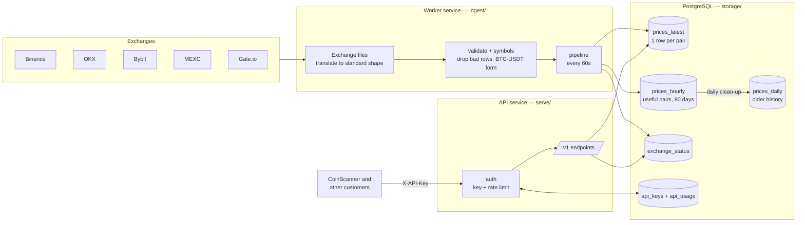

# Scanbase architecture

## Data flow

## Design decisions

| Decision | Why |
|---|---|
| Worker and API are separate services | A crash or deploy in one never takes down the other |
| One template for all exchanges | New exchange = one small file; bugs fixed once for all |
| Exchanges discovered automatically | Worker never edited when exchanges are added |
| Keep exchange's own symbol + our standard one | Match across exchanges, but always traceable to the source |
| `prices_latest` overwrites, `prices_hourly` appends | Live table stays tiny |
| Only useful pairs enter history | Most listed pairs are dead; saving all of them was est. 1–2 GB/month |
| Hourly kept 90 days, then summarised daily (open/high/low/close) | History size stays roughly fixed; long-term shape is kept |
| Summarise first, delete after, in batches | A crash never loses data; database never locks up |
| Bad main price → drop row; bad extra field → keep row | Never save wrong prices, never lose good ones over a missing bid |
| One exchange failing never stops the round | Failure is logged to `exchange_status` and shown in `/v1/status` |
| Every price carries `age_seconds` and `is_stale` | Customers never mistake old data for live data |
| API keys stored only as SHA-256 hashes | A database leak exposes no usable keys |
| Rate limit counted per key per hour in one DB trip | Accurate under parallel requests, table stays small |
| Migrations numbered and re-runnable | Same command safely updates any database |

## Current exchanges

Global: Binance (via data-api.binance.vision), OKX, Bybit, MEXC, Gate.io, KuCoin.
India (INR): CoinDCX (INR pairs only - its USDT pairs mirror Binance),
WazirX, Giottus (midpoint of bid/ask; pairs with >5% gap skipped), ZebPay.

Rejected: Kraken (unreachable), Bitbns (stale/wrong prices - BTC shown at
49,999 USDT when the market was ~76,000), Delta (only 6 spot pairs,
unreliable mark price).

The worker runs in Railway's Singapore region: Bybit blocks US servers.

## Known limits / next steps

- Symbol splitting relies on a known list of quote currencies
- No price cross-checking between exchanges yet (outlier detection)
- Rate limiting is per hour only (no per-second burst limit)
